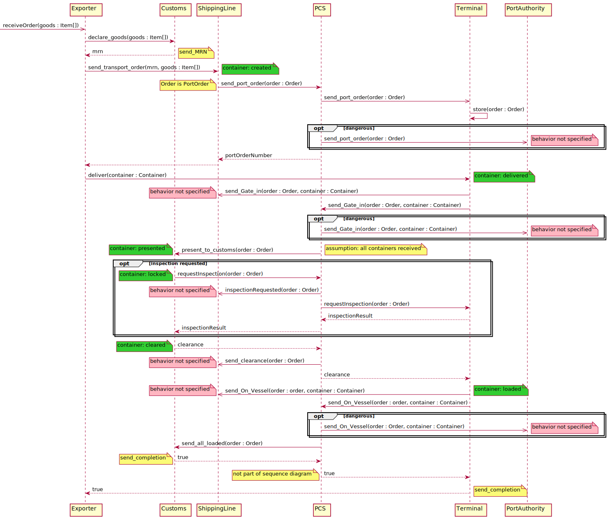
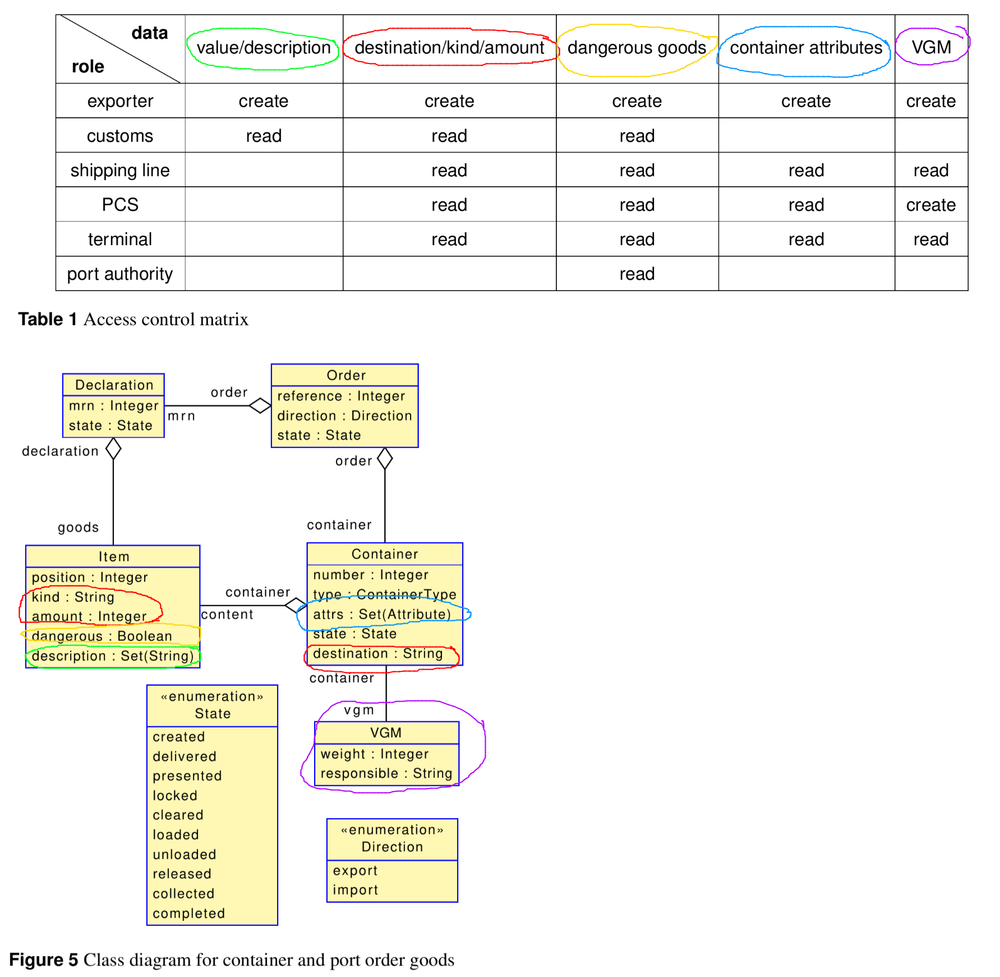
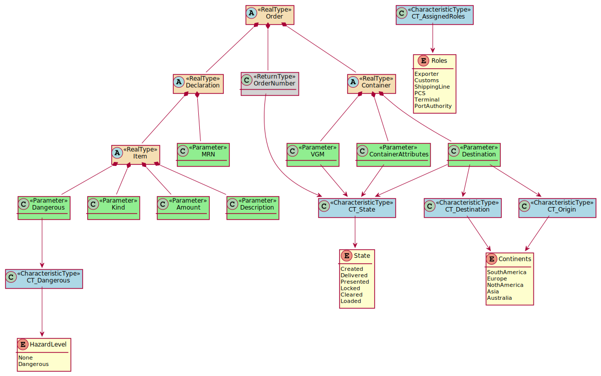

# Case Study Port Communication System

The case study is about a Port Communication System that mediates between different actors in shipping containers. The case study is based on [a publication](https://doi.org/10.5381/jot.2020.19.3.a8).

## Overview on Communication
The actors and exchanged messages between the actors are shown in the UML sequence diagram below. We adjusted the communication to meet limitations of the Palladio Component Model. Especially, it is not possible to call users in Palladio because all communication originates from users.

In the sequence diagram, the `Exporter` is a user. All other actors are system parts. We added notes to indicate changes or leave comments:
* Yellow: Gives information about original messages or changes with respect to the original publication.
* Green: Indicate if the status of a container changes at that particular position in the sequence diagram.
* Red: Indicate underspecified parts of the communication.

## Data Model
We do not use composite data types but model every individual data item composed in a larger data type. Especially, the data types `Order` and `Container` are used in the publication. However, a clear specification of the inner data types is missing. We derive this specification from the 

The publication describes the data model as shown in the figure below. Based on the data model, there are access control requirements given by an RBAC policy also shown in the figure below. Unfortunately, there is no perfect mapping between the RBAC policy and the data model because the `value` data type is missing. We assume that the `value` data type is part of the `Item`.

The sequence diagram does nto use the data types specified in the RBAC policy but only refers to `Order` and `Container`. To simplify the mapping between the RBAC policy and the exchanged data, we replace `Order` and `Container` by the data types, which represent them. The figure given below illustrates our approach. Colored nodes have different meanings:
* Orange: Data types available in the sequence diagram (will be replaced)
* Green: Data types used in newly introduced parameters
* Blue: Metadata about the exchanged data
* Yellow: Value range of meta data

